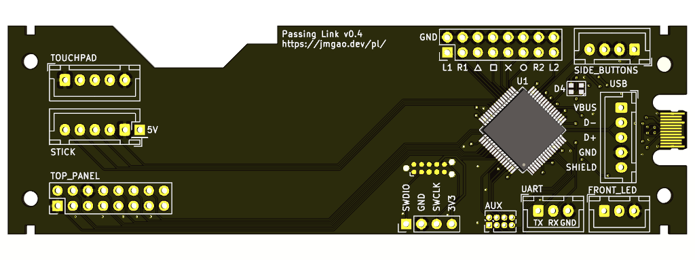
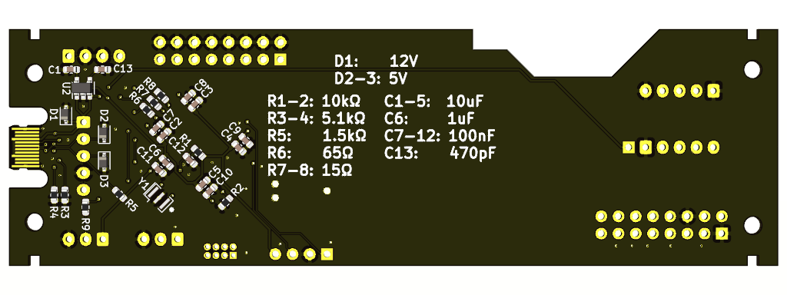

## Razer Panthera PCB

Drop in replacement for the Razer Panthera's PCB, with additional on-board RGB LED, [Tag-Connect](https://www.tag-connect.com/) connector, and USB-C connector (use 0.8mm thickness if you want to use this). Successfully fabricated at [JLCPCB](https://jlcpcb.com/), but assembled by hand since they don't do assembly for board thicknesses less than 1.0mm.

### TODO in next revision
- [ ] Wire up touchpad to SPI pins
- [ ] Sound output IC?
- [ ] Define a protocol to identify specific boards for GPIO mapping

### BOM

| Part type  | Part number            | Quantity | Cost per individual item                                     |
|------------|------------------------|----------|--------------------------------------------------------------|
| MCU        | STM32F103RET6          | 1        | [$1.65](https://www.ebay.com/sch/i.html?_nkw=STM32F103RET6)  |
| Oscillator | CSTCE8M00G15C99        | 1        | [$0.28](https://lcsc.com/search?q=C110614)                   |
| LDO        | MIC5219-3.3YM5         | 1        | [$0.10](https://www.ebay.com/sch/i.html?_nkw=MIC5219-3.3YM5) |
| RGB LED    | FM-B2020RGBA-HG        | 1        | [$0.03](https://lcsc.com/search?q=C108793)                   |
| Diode      | PESD12VL1BA,115        | 1        | [$0.05](https://lcsc.com/search?q=C38558)                    |
| Diode      | PESD5V0L1BA,115        | 2        | [$0.04](https://lcsc.com/search?q=C85380)                    |
| Pin header | Generic 0.1" 2x10 male | 2        | [$0.05](https://lcsc.com/search?q=C68234)                    |
| Pin header | Generic 0.1" 1x4 male  | 1        | [$0.02](https://lcsc.com/search?q=C358686)                   |
| Connector  | JST B5B-XH-AM          | 3        | [$0.10](https://lcsc.com/search?q=C161872)                   |
| Connector  | JST B4B-XH-AM          | 1        | [$0.08](https://lcsc.com/search?q=C161871)                   |
| Connector  | JST B3B-XH-AM          | 2        | [$0.07](https://lcsc.com/search?q=C161870)                   |
| Resistor   | 0603 10kΩ              | 2        | ~$0                                                          |
| Resistor   | 0603 5.1kΩ             | 2        | ~$0                                                          |
| Resistor   | 0603 1.5kΩ             | 1        | ~$0                                                          |
| Resistor   | 0603 65Ω               | 1        | ~$0                                                          |
| Resistor   | 0603 15Ω               | 2        | ~$0                                                          |
| Capacitor  | 0603 10uF              | 5        | ~$0                                                          |
| Capacitor  | 0603 1uF               | 1        | ~$0                                                          |
| Capacitor  | 0603 100nF             | 6        | ~$0                                                          |
| Capacitor  | 0603 470pF             | 1        | ~$0                                                          |
